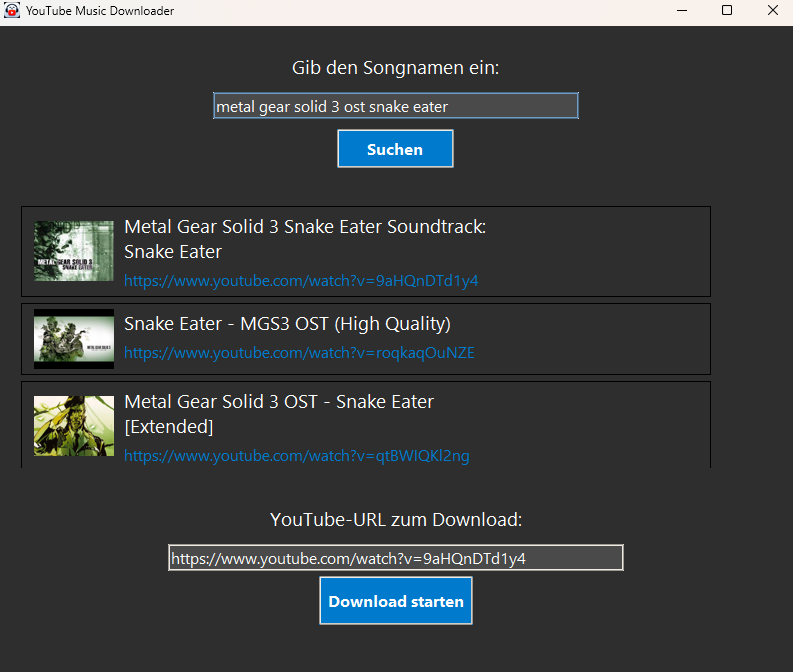

# YouTube Audio Downloader

A simple desktop application built with Python and Tkinter to search for and download the audio track from YouTube videos as high-quality FLAC files.

### Preview

### Features

- Song Search: Search for songs or videos directly by name.

- Results List: Displays the top 3 search results with titles and thumbnails.

- Easy Selection: Click on a search result to select it for download.

- High Quality: Downloads the best possible audio quality and converts it into a FLAC file.

- Intuitive Interface: A simple and easy-to-understand graphical user interface.

### Prerequisites

- Before you can run the script, you need to have a few things installed and set up:

- Python 3: You need an installed version of Python 3.

- FFmpeg: This program is required to convert the downloaded video files into FLACs.
         Download it from gyan.dev/ffmpeg/builds/.
    
- Extract it into a folder (e.g., C:\ffmpeg). Important: You must add the bin subfolder (e.g., C:\ffmpeg\bin) to your system's environment variables (Path).
    
Python Libraries: You will need the following Python packages: 
-  yt-dlp 
- Pillow 
- requests

## Disclaimer

This project is for educational purposes only. Downloading copyrighted material may violate YouTube's terms of service and the laws of your country. Please use this tool responsibly and respect copyright laws.
